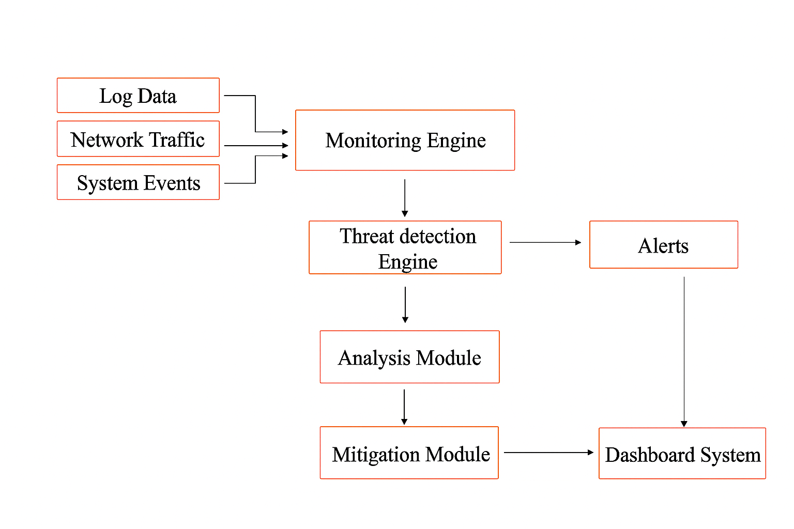
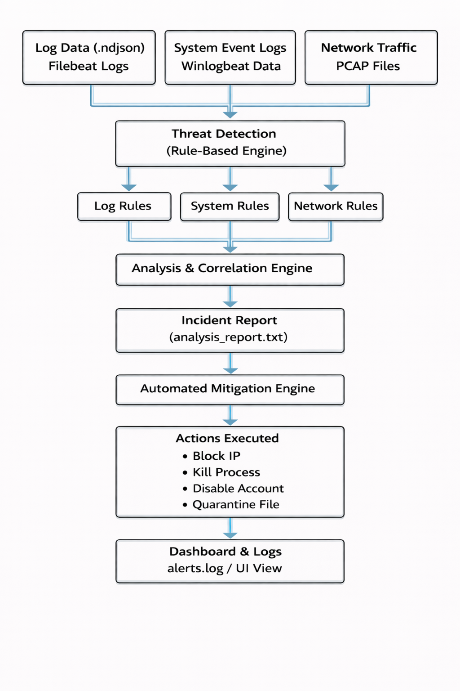
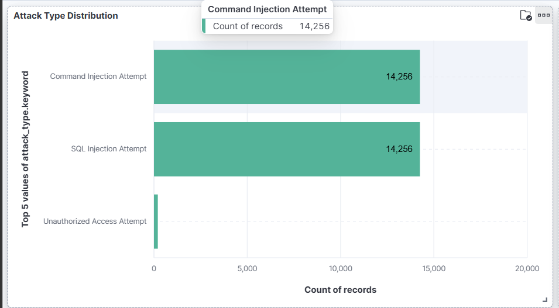
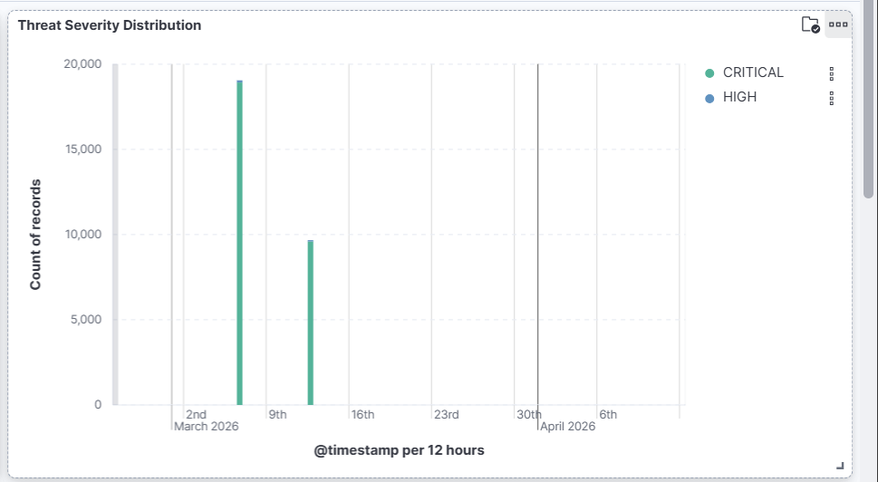
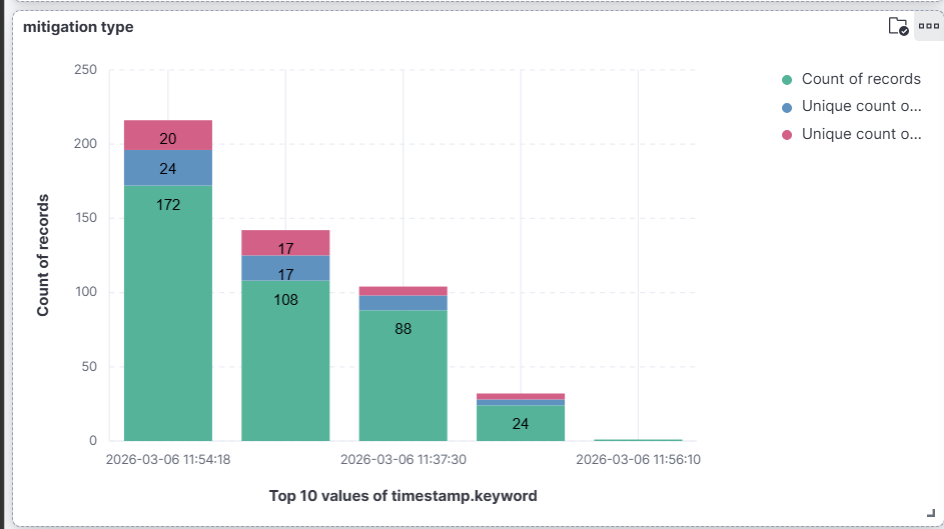
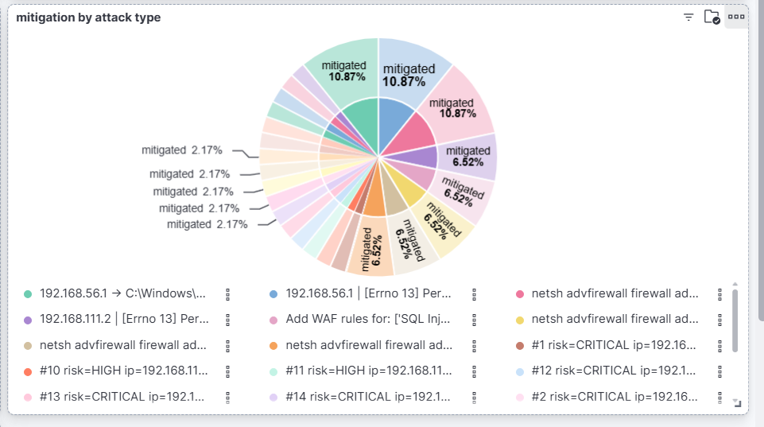
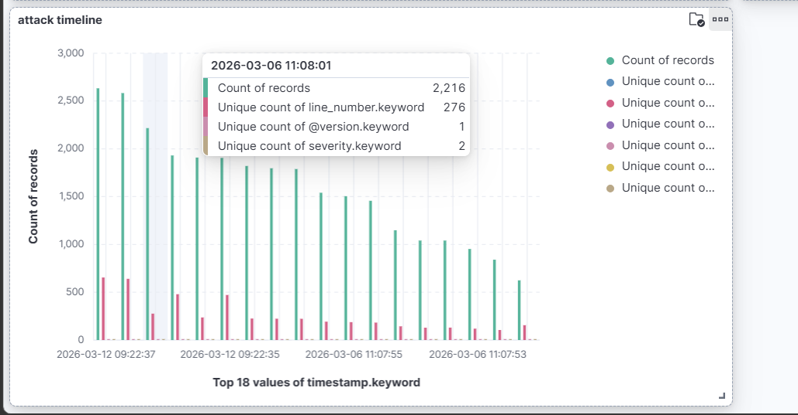

<div align="center">

# 🛡️ Autonomous Cyber Incident Response Framework

### Real-Time Threat Detection & Automated Mitigation

A rule-based, explainable cybersecurity framework that continuously monitors logs, network traffic, and system events — then detects, correlates, and **autonomously mitigates** threats in real time.

[](https://www.python.org/)
[](https://www.elastic.co/elasticsearch/)
[](https://www.elastic.co/kibana/)
[](https://www.wireshark.org/)
[](LICENSE)
[](#)

</div>

---

## 📖 Overview

Modern organizations face a growing volume of fast-moving cyber threats — SQL injection, command injection, brute-force attempts, lateral movement, and more — that routinely outpace manual, human-driven security operations. This project implements a **fully autonomous, rule-based Security Operations Center (SOC) pipeline** that closes the loop between detection and response, without relying on machine learning or black-box AI models.

The framework continuously ingests **application logs, Windows system events, and raw network traffic**, runs them through a deterministic rule engine, correlates related alerts into full incident narratives, and automatically executes containment actions — IP blocking, process termination, account disabling, and file quarantine — while visualizing everything on a live Kibana dashboard.

> Because every detection is rule-based rather than ML-driven, every alert is **fully explainable and auditable** — a key requirement for compliance-driven and academic security environments.

---

## ✨ Key Features

- 🔍 **Multi-source continuous monitoring** — Filebeat (application logs), Winlogbeat (Windows event logs), and PCAP-based network capture (Zeek / tcpdump / Wireshark)
- ⚙️ **Rule-based threat detection engine** — dedicated rule modules for logs, system events, and network traffic (SQL injection, command injection, brute force, PowerShell abuse, privilege escalation, malicious IPs, and more)
- 🔗 **Analysis & correlation engine** — links related alerts by IP, user, process, timestamp, and host to reconstruct multi-stage attack sequences and reduce false positives
- 📝 **Automated incident reporting** — structured, forensic-ready reports (`analysis_report.txt`) with attack type, severity, confidence score, and timeline
- 🤖 **Automated mitigation engine** — executes containment playbooks: block IP, kill process, disable account, quarantine file, isolate host
- 📊 **Real-time Kibana dashboard** — attack distribution, severity trends, mitigation statistics, and timeline analytics for SOC-style visibility
- 🧩 **Modular & extensible** — designed for future integration with SIEM/SOAR platforms, cloud telemetry, and threat intelligence feeds

---

## 🏗️ Architecture

The framework processes security data through five cooperating layers: monitoring → detection → analysis → mitigation → visualization, forming a **closed-loop autonomous defense cycle**.

<p align="center">
  
</p>

**Flow:** `Log Data / Network Traffic / System Events` → **Monitoring Engine** → **Threat Detection Engine** → **Alerts** (visualized instantly) → **Analysis Module** → **Mitigation Module** → **Dashboard System**

---

## 🔄 System Workflow

<p align="center">
  
</p>

1. **Data Ingestion** — Filebeat NDJSON logs, Winlogbeat Windows events, and PCAP network captures are collected continuously.
2. **Threat Detection** — Log rules, system rules, and network rules run in parallel against the incoming telemetry.
3. **Analysis & Correlation** — Related alerts are aggregated by IP, user, process, and timestamp into unified incident profiles.
4. **Incident Reporting** — Correlated incidents are written to `analysis_report.txt` with severity, confidence, and timeline.
5. **Automated Mitigation** — Predefined playbooks trigger IP blocking, process termination, account disabling, and file quarantine based on severity.
6. **Dashboard & Logging** — All alerts and actions are stored in `alerts.log` and rendered live on the Kibana dashboard for analyst review.

---

## 🧰 Tech Stack

| Category | Technologies |
|---|---|
| **Core Engine** | Python 3.10+ (`os`, `re`, `json`, `datetime`, `subprocess`, `scapy`, `pyshark`, `collections`, `ipaddress`, `threading`, `logging`) |
| **Monitoring & Visualization** | Elastic Stack — Filebeat, Winlogbeat, Elasticsearch, Kibana |
| **Network Analysis** | tcpdump, Wireshark, Zeek, PCAP |
| **Orchestration** | Docker Compose |
| **Alert Utilities** | Node.js (alert parsing) |
| **Environment** | Windows · VS Code |

---

## 📊 Results & Dashboards

Sample results from the framework running against a large-scale test dataset of application, system, and network logs.

<p align="center">
  
  <br><em>Attack Type Distribution — SQL Injection and Command Injection dominate detected threats.</em>
</p>

<p align="center">
  
  <br><em>Threat Severity Timeline — CRITICAL/HIGH incident spikes followed by successful containment.</em>
</p>

<p align="center">
  
  <br><em>Mitigation Actions Over Time — autonomous response volume decreasing as threats are contained.</em>
</p>

<p align="center">
  
  <br><em>Mitigation Mapping by Attack Type — multi-action response strategy (firewall rules, IP blocks, WAF recommendations).</em>
</p>

<p align="center">
  
  <br><em>Attack Timeline & Trend Analysis — attack volume drops sharply after automated mitigation kicks in.</em>
</p>

---

## 📂 Project Structure

```
ThreatDetection/
├── main_controller.py                     # Entry point — orchestrates the full pipeline
├── threat_detection_orchestrator.py       # Coordinates detection → analysis → mitigation
├── data_collector.py                      # Pulls in Filebeat / Winlogbeat / PCAP telemetry
├── docker-compose.yml                     # Elastic Stack (Elasticsearch + Kibana) services
├── filebeat.yml                           # Filebeat shipper configuration
│
├── rules/                                 # Rule-based detection engine
│   ├── log_rules.py                       #   → SQLi, command injection, brute force, etc.
│   ├── system_rules.py                    #   → Windows Event IDs, PowerShell abuse, privilege escalation
│   └── network_rules.py                   #   → suspicious ports, malicious IPs, lateral movement
│
├── analysis and correlation/
│   ├── analysis_and_correlation.py        # Correlates alerts into multi-stage incidents
│   └── analysis_report/
│       └── analysis_report.txt            # Generated incident report (forensic record)
│
├── mitigation/
│   └── automated_mitigation_engine.py     # Executes IP block / kill process / disable account / quarantine
│
├── alerts/
│   ├── alerts.log                         # Live alert stream
│   └── mitigation_log.txt                 # Record of autonomous actions taken
│
├── iocs/
│   └── bad_ips.txt                        # Blacklisted / known-malicious IP indicators
│
├── data/                                  # Raw telemetry (see .gitignore — not committed)
│   ├── filebeatdata/                      #   Filebeat NDJSON logs
│   ├── winlogbeatdata/                    #   Winlogbeat NDJSON logs
│   └── network data/                      #   PCAP / PCAPNG captures
│
├── utils/
│   └── alertParser.js                     # Node.js alert-parsing utility
│
├── assets/                                # Architecture diagram & dashboard screenshots (this package)
├── requirements.txt
├── package.json
├── .gitignore
├── LICENSE
└── README.md
```

### Elastic Stack setup (`elk-stack/`)
Elasticsearch, Kibana, and the Logstash ingest pipeline run as a separate stack:
```
elk-stack/
├── docker-compose.yml     # Elasticsearch + Kibana + Logstash services
└── pipeline/
    └── logstash.conf      # Logstash ingest pipeline config
```
You can push this as a subfolder of the same repo, or as its own `elk-stack` repo linked from here — either works, just update the clone command below to match.

---

## 🚀 Getting Started

```bash
# 1. Clone the repository
git clone https://github.com/RAHUL-167/Cyber-Incident-Response-Framework.git
cd Cyber-Incident-Response-Framework

# 2. Spin up the Elastic Stack (Elasticsearch + Kibana + Logstash)
cd elk-stack && docker-compose up -d && cd ..

# 3. Install Python dependencies
pip install -r requirements.txt

# 4. (Optional) install Node dependencies for the alert-parsing utility
npm install

# 5. Configure filebeat.yml to ship logs to your Elasticsearch instance,
#    and point data_collector.py at your log/PCAP directories under data/

# 6. Run the full detection & mitigation pipeline
python main_controller.py
#   → internally drives threat_detection_orchestrator.py, which runs
#     rules/*.py → analysis and correlation/analysis_and_correlation.py →
#     mitigation/automated_mitigation_engine.py

# 7. Open Kibana (default: http://localhost:5601) and load the dashboard/
#    index patterns to view live results
```

**Prerequisites:** Python 3.10+, Docker & Docker Compose, Elastic Stack (Elasticsearch + Kibana + Logstash), Filebeat, Winlogbeat, and a packet capture tool (tcpdump / Wireshark / Zeek). Node.js is required for the `utils/alertParser.js` utility.

---

## 🔮 Future Enhancements

- Integration with SIEM/SOAR platforms and cloud-native telemetry
- Machine-learning-assisted anomaly detection for zero-day threats
- MITRE ATT&CK technique mapping
- Enterprise-scale distributed deployment and horizontal scaling

---

## 👤 Author

**Gundala Nireekshan**
B.Tech, CSE (Cyber Security) — CMR College of Engineering & Technology
Under the guidance of Mrs. G. Saranya, Assistant Professor

---

## 📄 License

This project is released under the [MIT License](LICENSE).

---

<div align="center">
<sub>⭐ If you find this project useful, consider giving it a star!</sub>
</div>
